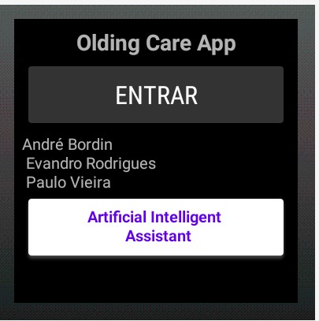

# olding care project(ocp)
The project
 
the ocp diagram

1. The ocp App

pycharm IDE for programming the app ocp

first screen

the toggle button (in red)  OFF

the toggle button (in red)  ON

button Activities 

Medical shedule

Medical shedule

Medical shedule

Medical shedule

