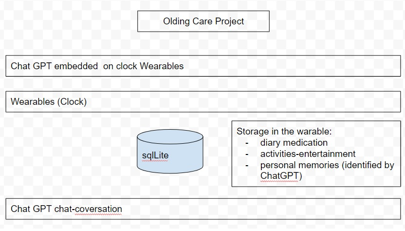
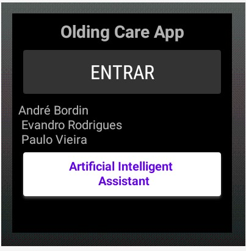
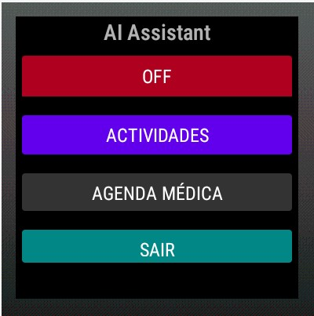
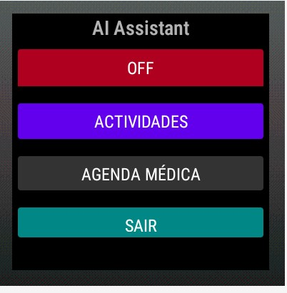

# olding care project(ocp)
1. The project
 
the ocp diagram

2. The ocp App

2.1 pycharm IDE for programming the app ocp

2.2 first screen, App start screen

2.3 general app screen

the toggle button (in red)  OFF

2.4 the toggle button (in red)  ON

2.5 Activities 

2.6 Medical shedule

2.7 Medical shedule

2.8 Medical shedule

2.9 Medical shedule

2.10 general app screen

